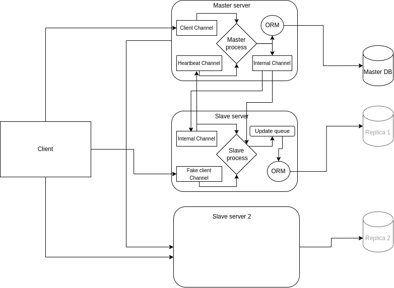

# Jmessage: N-Failstop Fault Tolerant Chat App

## Overview

This chat application is designed to be resilient against up to N failstop faults. It uses a master-slave architecture to ensure fault tolerance and relies on the gRPC protocol for communication between its components. This documentation provides a comprehensive overview of the application's structure and functionality, including file organization and protocol buffer definitions.

## How does it work?

This project has the following architecture.



All the slave servers follow the same structure as the first slave server. The server communicate amongs themselves accordin to the following protocol. The protocl descirption include initial setup instructions.

1. Create a server with a unique ID and a database. If not specified otherwise, it assumes the role of a master.
2. Additional slave servers could then be added with more unique ids. When creating another server, provide the master's address. This new server will act as a slave and establish communication with the master. When establishing a communication, here is what happens

   1. Slave asks to be registered in the system
   2. Master takes this request, notifies everyone in the system about the addition of the slave and respond with the latest version of the database
   3. The slave creates its own version of the local database based on the response
   4. The master will then send updates as necessary when there are changes to its database. On subsequent changes only the updates are send instead of the whole database
      1. Note: During initial database replication, the slave probably should block updating its database so that updates will not try to change the database before replication is complete
      2. Subsequent updates use a publish-subscribe pattern for asynchronous communication.
      3. Unique Id generation could potentially be automate by the server
      4. Adding more slaves might slow down the system as there will be more communications in place

3. The servers process messages from clients as usual, and the master server publishes the processed messages to the message queue for all slave servers
4. Slave servers periodically ping the master server to check its status (heartbeat). If the master server does not respond within a given time, the slaves initiate a master re-election process,
5. The master re-election process happens as follows:

   1. All the slaves are aware of each other, so the one with the smallest addres promotes themselves to a new master position and notify all the other slaves about the update
   2. The other slaves, will wait for a given period for update. If they don’t hear back in the given time, they will assume the slave has faild and thus will remote it from their list of available slaves and move on to step one of the process to elect the next master

6. The clients should be aware of all server addresses. If a client mistakenly communicates with a slave server, it receives a message notifying it that it isn’t a master. If the client does not receive a response, it means the node is down so it can get rid of it and look for other nodes.

   1. Here a load balancer/directory server could potentially be used but that will introduce another single point failure so it might not be good client experience but it won’t be as relient

The above protocl could be descirbed by the following pseduo code.

```javascript

// Server class
class Server {
    String uniqueID
    String role = "master"
    String masterAddress = null
    Database localDatabase
    MessageQueue messageQueue
    List<Slave> slaveServers
    List<Client> clients

    // Server constructor
    Server(String role, String masterAddress) {
        uniqueID = generateUniqueID()
        if (role == "slave") {
            this.role = "slave"
            this.masterAddress = masterAddress
            establishCommunicationWithMaster()
        }
    }

    // Establish communication with master server (for slave servers)
    function establishCommunicationWithMaster() {
        registerWithMaster()
        localDatabase = getDatabaseFromMaster()
        subscribeToUpdatesFromMaster()
    }

    // Register with the master server
    function registerWithMaster() {
        // Send request to master server to register this slave server
    }

    // Get the latest version of the database from the master server
    function getDatabaseFromMaster() {
        // Request and receive the latest version of the database from the master server
    }

    // Subscribe to updates from the master server
    function subscribeToUpdatesFromMaster() {
        // Subscribe to the message queue on the master server for updates
    }

    // Publish updates to all slave servers
    function publishUpdatesToSlaves() {
        // Send updates to the message queue for all slave servers
    }

    // Process client messages
    function processClientMessages() {
        // Process client messages and update local database
    }

    // Heartbeat function for checking master server status
    function heartbeat() {
        // Periodically ping the master server to check its status
    }

    // Master re-election process
    function reElectMaster() {
        // Initiate master re-election process
    }
}

// Client class
class Client {
    List<Server> serverAddresses

    // Send a message to the server
    function sendMessage() {
        // Send the message to the appropriate server
    }

    // Receive a message from the server
    function receiveMessage() {
        // Receive and process the message from the server
    }

    // Handle server communication errors
    function handleServerErrors() {
        // If communication error, update server list and retry
    }
}

```

## File Structure

The source code is organized as follows:

```bash
├── src
│ ├── base_client.py
│ ├── gui_client.py
│ ├── master_server.py
│ ├── models.py
│ ├── server.py
│ ├── slave_server.py
│ ├── spec_pb2_grpc.py
│ ├── spec_pb2.py
│ ├── spec_pb2.pyi
│ ├── spec.proto
│ ├── terminal_client.py
│ └── utils.py
├── tests
│ ├── test_base_client.py
│ ├── test_client.py
│ ├── test_database.py
│ └── test_server.py
```

<details><summary>src/</summary>

Clients

- `base_client.py`: Contains the BaseClient class, which is a generic chat client implementation.
- `gui_client.py`: Extends the BaseClient class to create a GUI-based chat client.
- `terminal_client.py`: Extends the BaseClient class to create a terminal-based chat client. [Depricated]

Server

- `master_server.py`: Implements the master server service as well as other methods.
- `slave_server.py`: Implements the slave server logic.
- `server.py`: Contains the main server logic, shared between the master and slave servers.

Models

- `models.py`: Contains the data models used in the application, such as User and Message.

Grpc setup

- `spec_pb2_grpc.py`: Generated gRPC code for the services defined in the spec.proto file.
- `spec_pb2.py`: Generated code from the spec.proto file for the message types.
- `spec_pb2.pyi`: Generated stub file for spec_pb2.py
- `spec.proto`: Protocol buffer definition file for the application's gRPC services and message types.

</details>

<details><summary>tests/</summary>

    `test_base_client.py`: Unit tests for the base_client.py file.

- `test_client.py`: Unit tests for the gui_client.py and terminal_client.py files.
- `test_database.py`: Unit tests for the models.py file.
- `test_server.py`: Unit tests for the master_server.py and slave_server.py files.

</details>

## Installation

To install this chat app on your computer follow the following steps.

**Clone the repository:**

```bash
git clone https://github.com/hileamlakb/jmessage.git
```

**Change directory**

```
cd Jmessage
```

**setup virual environment**

```
python -m venv venv
```

**Activate virtual environment**

on windows

```
venv\Scripts\activate
```

on Linux/mac:

```
source venv/bin/activate
```

**Install requirments**

```
pip install -r requirements.txt

```

You are done setting up!!

## **Usage**

**Start master server**

```
python src/server.py 1[id] master localhost:2625 [client address] localhost:2626[internal address]

```

**Start as many slaves as you need using master's internal address**

```
python src/server.py 2 slave localhost:2627 [client address] localhost:2628 [internal address] --master_address=localhost:2626
```

Don't forget to replace the interal addresses and the ids. The once given here can be used if they are free. Moreover the address don't need to be local.

**Start the client**

```
python src/gui_client.py -a [client facing addresses 1] [client facing addresses 2] ...

```

## Authors

- Hileamlak Y. (hileamlak@email.com)
- Jeremy Zhang

## License

This project is licensed under the MIT License - see the LICENSE.md file for details.
